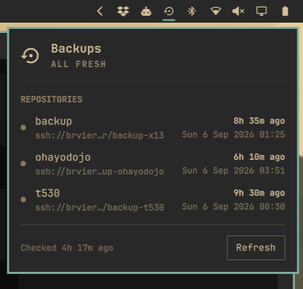

# QuickBorgmatic

An [Omarchy shell](https://omarchy.org) bar-widget plugin (Quickshell) that
monitors the freshness of [borgmatic](https://torsion.org/borgmatic/) backups
on a remote server.



- **Bar icon** (󰁯) that turns urgent the moment the newest backup in any
  repository is older than the stale threshold (default 48 h).
- **Popup panel** listing every configured repository with its last backup
  date and relative age; stale repositories are highlighted.
- **Failure banner** when the check itself can't reach the server: the last
  cached data stays visible, with when it was fetched.

## How it works

`Store.qml` runs `borgmatic repo-list --json` on a slow timer (default every
6 h: the call goes over SSH and briefly takes the borg repo lock), caches the
result to `~/.local/state/quickborgmatic/status.json` so status shows
instantly after a shell restart, and re-derives staleness from the cached
timestamps every minute. The plugin never reads the borgmatic config file;
its only interface is the borgmatic subprocess.

## Install

```sh
ln -s /path/to/QuickBorgmatic ~/.config/omarchy/plugins/fr.rvier.quickborgmatic
```

Then add the widget to the bar layout in `~/.config/omarchy/shell.json`,
e.g. in `bar.layout.right`:

```json
{ "id": "fr.rvier.quickborgmatic" }
```

and restart the shell: `omarchy-restart-shell`.

## Settings

Inline on the layout entry (or through the bar's widget settings UI):

| Key            | Default | Meaning                                     |
|----------------|---------|---------------------------------------------|
| `staleHours`   | 48      | Warn when the newest backup is older than this |
| `refreshHours` | 6       | How often to query the remote server        |

## Monitoring other machines' backups

Each machine should push its own backups (borgmatic runs there), but this
panel can *watch* any repository this machine can reach. Drop one
monitoring-only borgmatic config per machine into
`~/.config/quickborgmatic/monitor.d/`:

```yaml
# ~/.config/quickborgmatic/monitor.d/server1.yaml  (chmod 600)
repositories:
    - path: ssh://user@backup-host:22/home/user/backup-server1
      label: server1

encryption_passphrase: "that repository's passphrase"
```

The panel invokes borgmatic with this directory as an extra `--config`, so
every repository listed there shows up as its own row with its backup
freshness. The directory is outside borgmatic's default config locations on
purpose: the nightly backup run never sees these files, so nothing is ever
backed up *into* a monitored repository from this machine. This machine's
SSH key must be authorized on the repository host. A commented template ships
as [`example-monitor.yaml`](example-monitor.yaml); files without a `.yaml`/
`.yml` extension in `monitor.d/` are ignored, so keep disabled entries as
`<name>.yaml.disabled`.

## Usage

- Left click: open/close the panel.
- Right click: force a check now.
- In the panel: `r` or the Refresh button forces a check, `Esc` closes.
- IPC: `omarchy-shell fr.rvier.quickborgmatic toggle|open|close|refresh`.

## License

MIT
